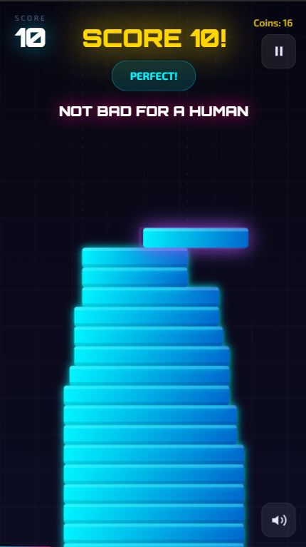
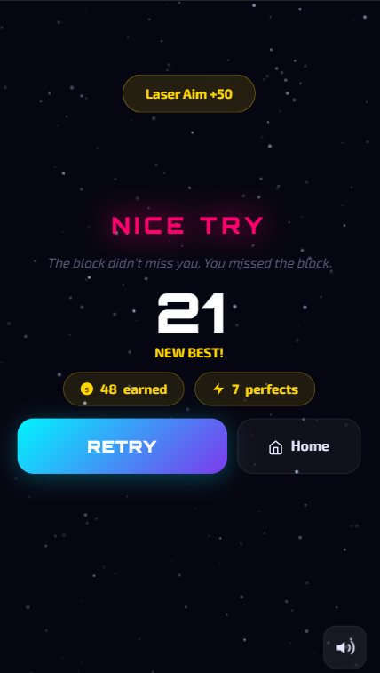

<div align="center">

# 🧱 Stack Rush

### *Tap. Stack. Repeat. How high can you go?*


[](https://stack-rush.vercel.app/)
[](https://github.com/yahskamrahs/Stack-Rush_HTML5_Game)

</div>

---

## 📸 Screenshots

| Home Screen | Gameplay | Shop | Leaderboard |
|:-----------:|:--------:|:----:|:-----------:|
|  |  |  |  |

> 💡 Screenshots are in the `/screenshots` folder of this repo.

---

## 🎮 What is Stack Rush?

**Stack Rush** is an addictive, infinite stacking arcade game — built entirely as a **single-file HTML5 PWA** with zero external dependencies.

Drop blocks with precise timing. The more perfectly you align them, the wider your stack stays — and the higher your score climbs. Earn coins, unlock skins, beat your personal best, and collect achievements. Best of all? It works completely **offline**.

> **"Infinite Precision"** — the tagline says it all.

---

## ✨ Features

### 🕹️ Core Gameplay
- **♾️ Infinite stacking** — Blocks keep coming; survive as long as your aim holds
- **🎯 Perfect alignment bonus** — Land blocks perfectly to earn extra coins and keep full width
- **⚡ Power-ups** — Collect mid-air power-ups for wild effects
- **🎨 Particle effects & combo system** — Satisfying visual feedback for every move

### 🖥️ Game Screens
- **🏠 Home** — Tracks your stats: coins, best score, total games, perfect drops
- **▶️ Play** — The main game canvas
- **🛒 Shop** — 8 unlockable block skins, purchasable with in-game coins
- **🏆 Leaderboard** — Local high-score board
- **⭐ Achievements** — 8 unique achievements to unlock

### 📱 Platform & UX
- **Fully responsive** — Works on mobile, tablet, and desktop
- **One-tap / Spacebar control** — Dead-simple input, instantly learnable
- **⏸ Pause menu** — Resume or return to menu anytime
- **🎓 Skippable tutorial** — Visual onboarding with no text walls
- **✈️ Offline play** — Service Worker caches everything for full offline support
- **📲 Installable PWA** — Add to home screen on Android/iOS like a native app

---

## 🕹️ How to Play

1. Open [stack-rush.vercel.app](https://stack-rush.vercel.app/) in your browser
2. Tap **PLAY** from the Home screen
3. **Tap the screen** or press **Space** to drop the moving block onto the stack
4. Aim for perfect alignment — the overhanging portion is sliced off each turn
5. Land **perfectly** to earn bonus coins and maintain full block width
6. The game ends when the block misses the stack completely
7. Collect coins → visit the **Shop** to unlock new skins
8. Chase **Achievements** and top the **Leaderboard**

| Control | Action |
|---------|--------|
| `Tap` / `Click` | Drop the block |
| `Space` | Drop the block |
| `Esc` | Pause the game |

---

## 🏗️ Project Structure

```
Stack-Rush_HTML5_Game/
├── index.html          # Complete game — all screens, logic, and styles in one file
├── manifest.json       # PWA manifest (fullscreen mode for Play Store)
├── sw.js               # Service Worker (offline caching)
├── icons/              # App icons — all sizes (72px → 512px)
│   ├── icon-72.png
│   ├── icon-96.png
│   ├── icon-128.png
│   ├── icon-144.png
│   ├── icon-152.png
│   ├── icon-192.png
│   ├── icon-384.png
│   └── icon-512.png
└── screenshots/        # Game screenshots
```

---

## 🚀 Getting Started

### ▶️ Play Instantly
No setup needed — just open the live link:
**[stack-rush.vercel.app](https://stack-rush.vercel.app/)**

### 💻 Run Locally

```bash
# Clone the repo
git clone https://github.com/yahskamrahs/Stack-Rush_HTML5_Game.git

# Navigate to the folder
cd Stack-Rush_HTML5_Game

# Open in browser (or use VS Code Live Server for PWA features)
open index.html
```

> ⚠️ For full PWA features (Service Worker, install prompt), serve over HTTPS or use a local dev server like [VS Code Live Server](https://marketplace.visualstudio.com/items?itemName=ritwickdey.LiveServer).

---

## 📲 Publishing to Google Play Store (TWA Method)

You can publish this PWA to the Google Play Store using a **Trusted Web Activity (TWA)** — no native Android code needed.

### Step 1 — Host the Game (HTTPS required)

The easiest free option is **GitHub Pages**:
1. Push this folder to a GitHub repo
2. Go to **Settings → Pages → Branch: main** and save
3. Your game will be live at `https://YOUR_USERNAME.github.io/REPO_NAME/`

### Step 2 — Generate TWA with Bubblewrap

```bash
npm install -g @bubblewrap/cli
bubblewrap init --manifest https://YOUR_URL/manifest.json
bubblewrap build
```

### Step 3 — Sign & Upload

1. `bubblewrap build` generates `app-release-signed.apk`
2. Upload to [Google Play Console](https://play.google.com/console) → **Create App → Internal Testing**
3. Add `assetlinks.json` to your server (Bubblewrap generates this file for you)

### Step 4 — Asset Links (required for TWA verification)

Create `/.well-known/assetlinks.json` on your HTTPS host:

```json
[{
  "relation": ["delegate_permission/common.handle_all_urls"],
  "target": {
    "namespace": "android_app",
    "package_name": "com.stackrush.game",
    "sha256_cert_fingerprints": ["YOUR_SIGNING_KEY_SHA256"]
  }
}]
```

---

## 🎰 CrazyGames Compliance

This game is fully compliant with [CrazyGames](https://www.crazygames.com/) submission requirements:

| Requirement | Status |
|-------------|--------|
| Tutorial is skippable | ✅ |
| Visual onboarding (no text walls) | ✅ |
| Consistent resolution & art style | ✅ |
| No Escape / Ctrl+W key conflicts | ✅ |
| Clear UI labels and goals | ✅ |
| Unique game name | ✅ |
| Responsive for all screen sizes | ✅ |

---

## 🛠️ Built With

| Technology | Purpose |
|------------|---------|
|  | Game structure, canvas rendering, all UI screens |
|  | Game logic, animations, Service Worker |
|  | Installability, offline support, fullscreen mode |
|  | Hosting & deployment |

---

## 👨‍💻 Author

<div align="center">

**Akshay Kumar Sharma**

[](https://akshaykumarsharma.in)
[](https://github.com/yahskamrahs)
[](https://www.linkedin.com/in/akshaykumar-sharma-b803a6264/)

</div>

---

## 📄 License

This project is open source and available under the [MIT License](LICENSE).

---

<div align="center">

Made with ❤️ by [Akshay Kumar Sharma](https://akshaykumarsharma.in)

⭐ **Enjoyed the game? Drop a star on GitHub!**

</div>
